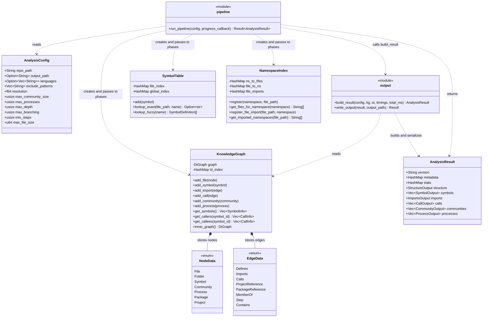
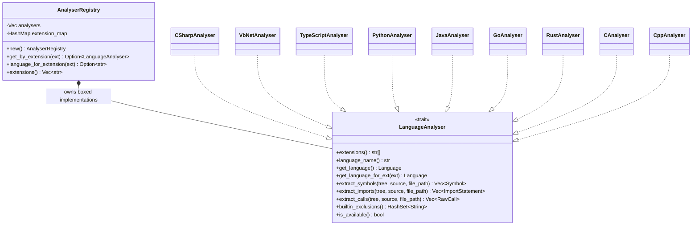

# Mycelium

A static analysis tool that maps the connections in a source code repository. A Rust engine runs
six analysis phases and produces a JSON map of files, symbols, imports, calls, communities, and
execution flows. Both the native CLI and the Python package use the same engine.

## Architecture

The diagrams show the current Rust implementation. Boxes are structs unless marked `module`,
`trait`, or `enum`; module operations are free functions. Only the main fields and methods are
shown, with signatures shortened for readability. `..>` means uses, `*--` means owns, and `..|>`
means implements. See the
[Mermaid class diagram syntax](https://mermaid.js.org/syntax/classDiagram.html).



`run_pipeline()` creates one graph and two lookup indexes for each run. The phases execute in
order, enriching the shared graph. `SymbolTable` finds symbols by file/name or across the whole
repository; `NamespaceIndex` connects namespace declarations and imports to files. These indexes
support resolution without repeatedly searching the entire graph.

The graph stores `NodeData` and `EdgeData` enum values. Input records such as `Symbol`, `CallEdge`,
`Community`, and `Process` are converted into graph nodes and edges. Community membership and
process steps are stored as edges. `output::build_result()` converts the graph into the separate
output structs in `AnalysisResult`.

`run_pipeline()` returns data; the CLI writes the output file. The Python binding converts the
result to a Python dictionary. Calling `mycelium.analyze()` alone does not write a JSON file.

### Language Analysers

Structure, parsing, imports, and calls each create an `AnalyserRegistry`. It selects a boxed
`LanguageAnalyser` implementation by file extension. Phase functions own Tree-sitter parsing;
analysers select the grammar and extract language-specific records from the syntax tree.



Each analyser explicitly implements the Rust trait. The trait requires `Send + Sync`, but the
current pipeline and file-processing loops run sequentially.
There is no analyser `parse()` method: parsing, imports, and calls each parse the source they need.

## Analysis Pipeline

Phase implementations live in `crates/mycelium-core/src/phases/`.

| Phase | Module | Responsibility |
|---|---|---|
| 1. Structure | `structure.rs` | Walk files, apply exclusions and size limits, record languages. |
| 2. Parsing | `parsing.rs` | Extract symbols; populate the graph and both lookup indexes. |
| 3. Imports | `imports.rs` | Resolve file imports and .NET project/package references. |
| 4. Calls | `calls.rs` | Resolve call sites using imports, types, local names, and global names. |
| 5. Communities | `communities.rs` | Cluster the weighted call graph with Louvain. |
| 6. Processes | `processes.rs` | Trace call paths from entry points with breadth-first search. |

Call resolution records both a confidence and a reason:

| Tier | Confidence | Resolution |
|---|---|---|
| A | 0.9 | Imported symbol or dependency-injection parameter type. |
| A | 0.85 | Interface-to-implementation match. |
| B | 0.85 | Symbol in the same file. |
| C | 0.5 / 0.3 | Unique / ambiguous global name match. |

These are static heuristics. A call edge or execution flow describes a possible connection, not
proof of runtime behaviour. Community detection uses the local Rust Louvain implementation, with
resolution tuning and splitting of oversized groups. Process tracing limits depth and branching,
deduplicates traces, and stores the product of call-edge confidences as `total_confidence`.

## Supported Languages

All analyser source files below are in `crates/mycelium-core/src/languages/`.

| Analyser | Languages | Registered extensions | Source |
|---|---|---|---|
| `CSharpAnalyser` | C# | `.cs` | `csharp.rs` |
| `VbNetAnalyser` | VB.NET | `.vb` | `vbnet.rs` |
| `TypeScriptAnalyser` | TypeScript, JavaScript | `.ts`, `.tsx`, `.js`, `.jsx` | `typescript.rs` |
| `PythonAnalyser` | Python | `.py` | `python.rs` |
| `JavaAnalyser` | Java | `.java` | `java.rs` |
| `GoAnalyser` | Go | `.go` | `go_lang.rs` |
| `RustAnalyser` | Rust | `.rs` | `rust_lang.rs` |
| `CAnalyser` | C | `.c`, `.h` | `c_cpp.rs` |
| `CppAnalyser` | C++ | `.cpp`, `.cxx`, `.cc`, `.hpp`, `.hxx`, `.hh` | `c_cpp.rs` |

TypeScript and JavaScript share an analyser, which reports `TypeScript` as its language name and
selects the grammar by extension. `.mjs` and `.cjs` are handled in its grammar selector but are
not registered, so they are not currently parsed by the pipeline despite the README listing them.
The VB.NET grammar is vendored in `vendor/tree-sitter-vb-dotnet/` for Tree-sitter ABI compatibility.

## Project Structure

```text
crates/
  mycelium-core/src/
    config.rs           Shared records, configuration, and output structs
    pipeline.rs         Six-phase orchestration, timing, and progress callbacks
    graph/              KnowledgeGraph, SymbolTable, NamespaceIndex, entry-point scoring
    phases/             Analysis stages
    languages/          LanguageAnalyser trait, registry, and implementations
    dotnet/             Solution, project, and assembly reference support
    output.rs           Build AnalysisResult and write JSON
  mycelium-core/tests/  Rust integration tests
  mycelium-cli/         Native CLI using clap
  mycelium-python/      PyO3 bindings: analyze(), version(), PyAnalysisConfig
mycelium/               Python exports and Click/Rich CLI
tests/
  fixtures/             Source repositories shared by Rust and Python tests
  test_bindings.py      Python binding smoke tests
vendor/                 Vendored VB.NET grammar
```

Keep analysis logic in `mycelium-core`; both command-line interfaces should remain thin wrappers.
`ARCHITECTURE.md` is an earlier Python design proposal. Use the Rust source and this guide for
the implemented architecture, and consult that proposal for historical intent.

## Development

```bash
# Native CLI; writes a structural map to the chosen path
cargo run -p mycelium-cli -- analyze tests/fixtures/csharp_simple -o /tmp/mycelium-map.json

# Python bindings: create a development environment, then build the Rust extension
python3 -m venv .venv
source .venv/bin/activate
python -m pip install maturin pytest click rich
maturin develop --release

# Python CLI (uses the same Rust engine)
mycelium-map analyze tests/fixtures/csharp_simple -o /tmp/mycelium-map.json --verbose
```

Rebuild with `maturin develop --release` after Rust changes before testing the Python interface.
Python requires 3.12 or newer. Maturin builds the extension as `mycelium._mycelium_rust`.

## Test Philosophy

Validate observable analysis results using small source fixtures or deliberately constructed
graphs. For features and bug fixes, use TDD: reproduce the missing behaviour with a failing test,
implement a complete vertical slice, and run the relevant regression tests. A parser fix should
check the extracted records; a resolution fix should also check the resulting graph edges.

| Suite | Location | Purpose | Runs in CI |
|---|---|---|---|
| Rust unit | Inline `#[cfg(test)]` modules | Data types, indexes, and algorithm helpers. | Yes |
| Rust integration | `crates/mycelium-core/tests/` | Fixtures, phases, pipeline, JSON. | Yes |
| Python bindings | `tests/test_bindings.py` | Extension API, config, progress, and exports. | Yes |

```bash
# All Rust tests, including fixture-based full-pipeline checks
cargo test --workspace

# Focused examples while iterating
cargo test -p mycelium-core --test test_pipeline
cargo test -p mycelium-core --test test_calls

# CI lint and formatting checks
cargo clippy --workspace -- -D warnings
cargo fmt --all -- --check

# After building the extension in the active virtual environment
python -m pytest tests/test_bindings.py -v
```

Keep code and Markdown lines within 100 columns. Update these diagrams when the main types or
their relationships change. When modifying third-party library usage, consult the Context7 skill.

## CI/CD

- `.github/workflows/ci.yml`: pushes and pull requests to `master` run Rust tests, Clippy,
  formatting checks, and Python binding tests on Ubuntu with Python 3.12.
- `.github/workflows/release.yml`: `v*` tags build Linux and macOS wheels for x86_64 and aarch64,
  Windows wheels for x86_64, and a source distribution, then publish to PyPI as `mycelium-map`.

## Known Limitations

- Every run scans the repository afresh; there is no incremental analysis or shared syntax cache.
- TypeScript import resolution handles relative paths; `tsconfig.json` path aliases are unsupported.
- Static call resolution is heuristic, especially when several symbols share the same name.
