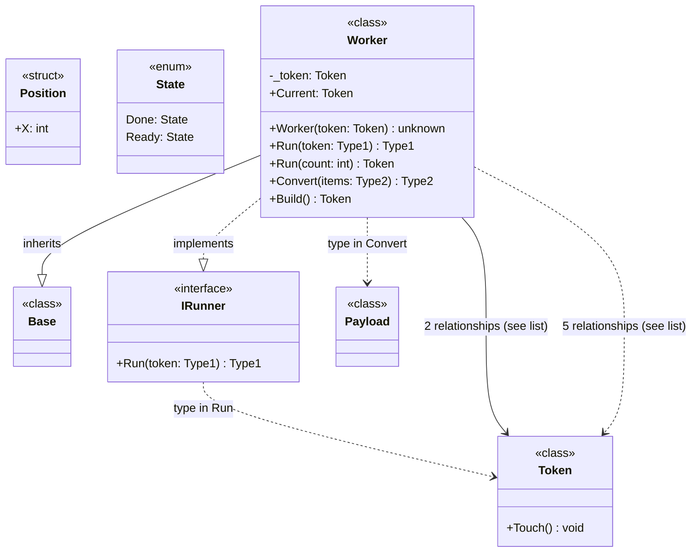

# Mermaid class diagrams

Declared types and signatures; unknown types are `unknown`. Receivers are omitted.
Fields are associations, not lifetime ownership. Calls are static heuristic estimates.
Members and connections within each view are uncapped.
Parallel arrows are summarized.
Cross-diagram relationships are retained in the complete relationship list.

Included: 7 boxes. Calls without in-scope endpoints: 0.

## Test filtering

Mode: exclude.
Saved detector version: 2.
Test paths: none.
Keep paths: none.
Calls removed by test filtering: 0. Type relationships removed: 0.

## Diagram 1

## Source index

- c0000: `Base` — `Model.cs`:3
- c0001: `IRunner` — `Model.cs`:6
- c0002: `Payload` — `Model.cs`:4
- c0003: `Position` — `Model.cs`:8
- c0004: `State` — `Model.cs`:7
- c0005: `Token` — `Model.cs`:5
- c0006: `Worker` — `Model.cs`:10

## Relationships

- c0001 ..> c0005: `type in Run`
- c0006 --|> c0000: `inherits`
- c0006 ..|> c0001: `implements`
- c0006 ..> c0002: `type in Convert`
- c0006 --> c0005: `field Current`
- c0006 --> c0005: `field _token`
- c0006 ..> c0005: `Build() calls Touch()`
- c0006 ..> c0005: `Build() constructs Token`
- c0006 ..> c0005: `type in Build`
- c0006 ..> c0005: `type in Run`
- c0006 ..> c0005: `type in Worker`

## Type key

- Type1: `Token?`
- Type2: `List<Payload?>`
